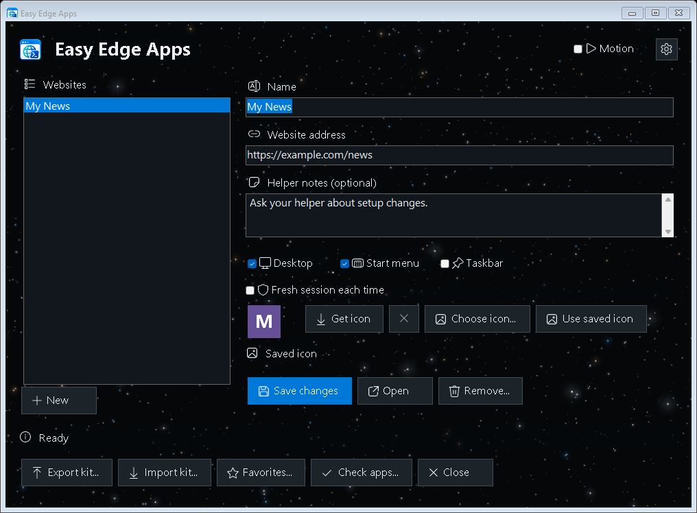
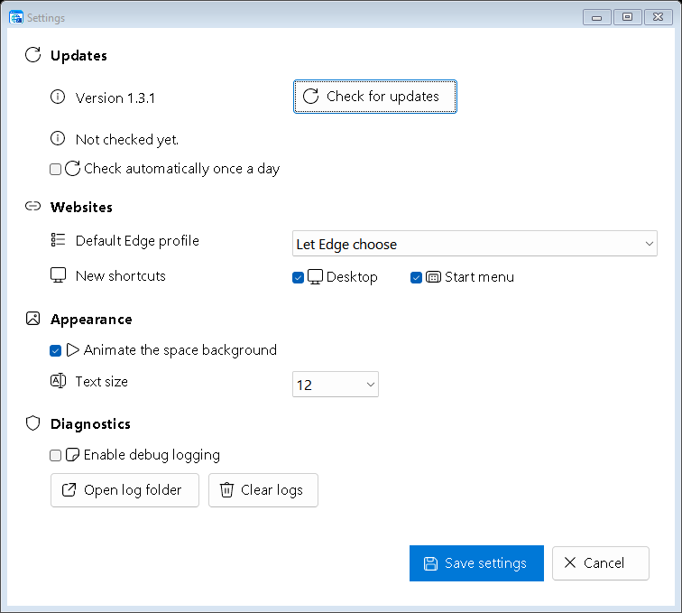

<p align="center">
	
</p>

# Easy Edge Apps

Turn trusted websites into easy-to-find Microsoft Edge app-window shortcuts on Windows 11. Install Easy Edge Apps as a normal Windows application, or use the same self-contained PowerShell script as a portable tool.

A helper sets it up once in the person's Windows account. Everyday use is opening a familiar Desktop, Start menu, or approved taskbar shortcut, with no PowerShell window or administrator prompt. Normal shortcuts open Edge directly; taskbar apps and fresh sessions use a small Windows launcher while their app window is open.

Set up someone's everyday websites once. Restore and maintain that familiar setup whenever they need help.

[Download MSI (x64)](https://github.com/blakedrumm/EasyEdgeApps/releases/latest/download/EasyEdgeApps-1.3.3-x64.msi) | [Download portable script](https://github.com/blakedrumm/EasyEdgeApps/releases/latest/download/EasyEdgeApps.ps1) | [Latest release](https://github.com/blakedrumm/EasyEdgeApps/releases/latest) | [Automated checks](https://github.com/blakedrumm/EasyEdgeApps/actions/workflows/test.yml)

**Version 1.3.3:** Adds a **Taskbar** checkbox that requests a real Windows-approved pin and keeps the website window under its own icon. Taskbar apps use dedicated profiles; **Fresh session each time** instead uses independent Guest profiles and fixes the repeated Edge account/sync popup. Normal Edge data stays untouched. After updating from 1.3.2, close fresh windows and use **Check apps... > Repair Selected** to update their launchers. Encrypted exports remain experimental and require independent security review before production use. See the [release notes](docs/releases/v1.3.3.md).

This release also fits setup to the available monitor space, improves high-resolution background painting, explains blocked icon retrieval, and shows current and proposed browsing modes in maintenance/import details. See the [production-readiness review](docs/Production-Readiness-Review.md) for measured results, retained compatibility, and outstanding acceptance limits.

## Setup for a family member

1. Sign in to **the Windows account that will use the shortcuts**. Do not run setup as administrator or as another user.
2. Download and open **EasyEdgeApps-1.3.3-x64.msi**. Complete its installation wizard, then open **Easy Edge Apps** from Start. The installer is per-user and does not request administrator rights.
3. Open the gear menu and **Preferences...** to choose a default Edge profile or adjust text size, placement, and motion. For the portable option, download **EasyEdgeApps.ps1** instead and use **Run with PowerShell**, or the one-time command below. No other manager download is needed; website launchers are generated locally when selected.
4. Enter a familiar name, such as **My Mail**, and the website address. You can omit `https://`; **Add website** and **Get icon** resolve a missing scheme HTTPS-first. Optionally select **Get icon** to retrieve its website icon. Select **Taskbar** for a dedicated app window and a Windows pin request; its required Start menu entry stays selected. To start with empty cookies and cache every time, also select **Fresh session each time** for this website.
5. Select **Add website**, approve any profile-mode change and Windows pin confirmation, then open the saved shortcut or taskbar icon. Complete website sign-in together. Check the site's text size, links, and any printing or video calling the person needs. See [Pin a website to the taskbar](#pin-a-website-to-the-taskbar) for support requirements and retained-data behavior.
6. Close setup. The person can now open the website using its shortcut. Return through **Easy Edge Apps** in Start for future changes, or keep the portable script somewhere the helper can find it.

For the portable script downloaded to the usual Downloads folder:

```powershell
powershell.exe -NoProfile -STA -ExecutionPolicy Bypass -File "$env:USERPROFILE\Downloads\EasyEdgeApps.ps1"
```

This execution-policy option applies only to that PowerShell process. It does not change the computer's saved policy. The MSI launcher uses the same process-only option. The script, launcher, and MSI are unsigned; review the source and obtain downloads from this repository. Windows may show an unknown-publisher or reputation warning. Do not disable SmartScreen, antivirus, or organizational controls to make them run. On a managed computer, ask its administrator if execution or installation is blocked.

Use ordinary site addresses, not password-reset links, one-time sign-in links, or URLs containing secrets. Addresses, including query strings and fragments, are saved locally in clear text.



The screenshot uses paused animation and synthetic example data.

## Fresh sessions per website

Select a saved website, check **Fresh session each time**, select **Save changes**, and approve the session-mode change. For a new website, check it before **Add website**. This is off by default and applies only to that website, not every website or your normal Edge browser.

Every launch from its saved shortcut gets a new temporary Edge Guest profile with empty cookies, cache, local storage, and other site data. Guest mode prevents Edge browser-account sign-in and sync, including the repeated automatic-sign-in popup. Website sign-in is separate and remains available. Two launches are independent, even for the same website. Closing one does not reset another. The small Windows launcher stays open without a console, tracks that session's browser process tree, and removes only its own temporary profile after the tree exits. Close related popup windows too; a remaining session process can delay cleanup. PowerShell and the manager do not need to stay open while browsing.

**Existing fresh websites from 1.3.2:** Close their windows, update the manager to 1.3.3 or later, open **Check apps...**, select the repairable websites, then **Repair Selected** and approve. Saving each website again also rebuilds its launcher. Installing the new MSI alone does not replace these per-website executables. The updated app window shows **[Guest]** in its title; there is no need to remove and recreate the website.

Normal Edge profile data is neither copied nor cleared. A stored normal-profile selection is retained for when both Fresh and Taskbar are off. Turning Fresh off while Taskbar remains selected uses that website's persistent dedicated app profile instead. Sign-ins and site preferences usually need repeating in fresh sessions, but Windows or site single sign-on can still authenticate independently; this is not a guaranteed anonymous or signed-out mode. Downloaded files outside the temporary profile remain. External links or applications that leave this profile are outside its cleanup scope.

Cleanup is not secure erasure. A crash, power loss, permission failure, or persistent file lock can leave marked data on disk. That profile is never reused, and the next fresh launch of the same website retries cleanup. A cleanup failure shows a warning. Resolve warnings before disabling or removing the website: those operations do not sweep leftover session folders. Normal browsing, downloaded files, operating-system traces, and server-side records are not erased.

Fresh sessions require Windows 11 x64, a non-elevated user session, Edge with Guest mode available, and the Windows .NET Framework compiler when saving, importing, or repairing the website. No SDK download is needed. Policies that override Edge's `UserDataDir`, disable `BrowserGuestModeEnabled`, or force `BrowserSignin` block fresh launches; organization controls may also block generated executables. The tool does not change policies or fall back to a normal profile. Close that website's fresh windows before changing or removing it. A missing or changed launcher needs **Check and Repair**; modified files are not silently overwritten.

For taskbar access, use the **Taskbar** checkbox and approve Windows' request. Replace older pins that target Edge directly: they bypass the fresh-session launcher. Unpin before switching both Fresh and Taskbar off or removing the website. See the [taskbar workflow](#pin-a-website-to-the-taskbar) and [security boundaries](SECURITY.md#fresh-session-boundaries).

## Pin a website to the taskbar

1. Select a saved website, or enter a new one. Check **Taskbar** beside Desktop and Start menu. Start menu stays selected because Windows needs that entry.
2. Select **Save changes** or **Add website**. Approve the dedicated-profile change when requested. With Fresh off, sign in once inside the new app profile; normal Edge sign-ins are not copied.
3. Approve **Windows' own pin confirmation**. Activate the small window bearing the website's name if Windows is waiting for foreground interaction. Setup reports success only after Windows confirms the pin. An already pinned app does not need another approval.
4. Open the new taskbar icon. The Edge app window uses the saved website icon and identity, grouped with that pin instead of a separate Edge taskbar entry.

**Profile behavior:** Taskbar with Fresh off keeps a dedicated browser profile for that website. Reopening a running app focuses its existing window. Taskbar with Fresh on creates a separate empty Guest profile on every launch; multiple launches remain independent but share the website's taskbar group. These are real Edge app windows, not a browser embedded in the setup window. The manager can close while they remain open. Edge security and website popups still apply; normal Edge windows are not relabeled or closed.

**Windows support:** Native desktop pin requests require a compatible, updated Windows 11 shell. Microsoft removed the token requirement in KB5074105 (builds 26100.7705/26200.7705); the app checks runtime capability. Policy, notifications, foreground restrictions, or a missing Start entry can still prevent approval. Unsupported systems show the checkbox disabled. The tool does not use hidden pinning verbs, edit taskbar registry data, or bypass policy. A declined, cancelled, or unavailable pin leaves the website saved in the chosen app mode. Select **Save changes** again to retry.

The checkbox stores the local request and app mode, not Windows' live pin state. **Unpin using the Windows taskbar menu** before removing the website or opting out; clearing the checkbox does not unpin it. Persistent app data is retained after enabling Fresh, opting out, removal, or MSI maintenance; Fresh cleans only its new temporary sessions. Windows caches pin icons, so unpin and save again if an icon is stale. App Kits do not transfer this choice or pin state, and imports/repair never request pins. A kit that removes an existing taskbar app's Start entry is blocked in preview.

## Settings and updates

Open the gear menu, then **Preferences...**. Settings are grouped into **Updates**, **Websites**, **Appearance**, and **Diagnostics**, with related controls on shared rows. All four sections fit at the default text size; enlarged text remains scrollable, with **Save settings** and **Cancel** at the bottom right. Changes take effect after **Save settings**; **Cancel** discards unsaved choices. The main window's **Motion** checkbox saves its choice immediately.

Setup opens at a normal window size and grows vertically to fit its editor when the current monitor has room. Saved text sizes are measured after layout; the window stays within the working area instead of forcing maximization. Smaller displays retain scrolling. The website-name field receives initial keyboard focus, and changing preferences preserves the active field and any required Start menu placement for Taskbar.

| Setting | Default | Effect |
| --- | --- | --- |
| Automatic update checks | Off | Checks GitHub at most once per 24 hours when setup opens or preferences are saved |
| Edge profile for new websites | Let Edge choose | Optionally saves a local `Default` or `Profile <number>` identifier with newly created apps |
| Desktop and Start menu shortcuts | Both on | Initial placement in the new-website editor; at least one is required |
| Animate the space background | On | Respects Windows reduced-motion, high-contrast, and remote-session settings |
| Text size | 12 points | Choose 12, 14, 16, or 18 points for setup, its menu, and owned helper dialogs |
| Debug logging | Off | Writes limited, local diagnostic events; nothing is uploaded |



**Check for updates** is available from the gear menu and Settings, even with automatic checks off. A detected newer stable release exposes **Download update**, which opens the official GitHub release page. No application code is downloaded or installed by the checker. Close setup, download the new MSI, and run it to upgrade; portable users replace their reviewed script. Checks can be cancelled, and connection or rate-limit failures leave the installed version unchanged.

Automatic checking is opt-in and happens only while setup is in use. There is no scheduled task, service, or checker running when setup is closed. A timestamp also throttles failed attempts; manual checks bypass that daily limit. GitHub receives an ordinary public release request and can observe its source IP and time. No saved website addresses, notes, profiles, or logs are sent. Update requests do not follow redirects, use browser cookies, or send Windows credentials.

Changing the default profile does **not** change existing apps. Updates, repair, and opening a saved app retain that app's profile. New apps, including new imports, use the destination user's default. Profile identifiers and global preferences never travel in App Kits. Choosing a profile does not copy sign-ins or change Edge's browser files; missing profiles and site sign-in still need the helper's attention. The [automation guide](docs/Automation.md#edge-profiles) covers explicit per-app overrides.

Debug logs record event names, outcomes, UTC timestamps, application/host versions, and exception type names, not error messages, URLs, helper notes, passwords, browser content, or full stack traces. They cover setup, settings, app save/open/remove, UI errors, and update checks, not a transcript of every CLI operation. Logs rotate at approximately 256 KiB and retain one previous file. **Open log folder** and **Clear logs** are available in Settings. Disabling logging does not delete existing logs; clear them separately when no longer needed.

## Installed application

The x64 MSI places the manager, portable script, license, and notices in `%LOCALAPPDATA%\Programs\Easy Edge Apps`. It registers **Easy Edge Apps** with Windows Installer and Installed Apps and creates a manager shortcut in Start. The manager launcher runs Windows PowerShell only while the management window is open. Normal website shortcuts launch Edge directly; Fresh and Taskbar shortcuts use their separately generated per-website executable, without PowerShell.

Install newer MSIs in the same Windows account to upgrade. Older MSI versions are rejected. Reopening the installed MSI offers maintenance; repair restores application files and the manager shortcut. To uninstall, use **Settings > Apps > Installed apps > Easy Edge Apps**. Uninstall removes the manager's files and shortcut, but preserves saved websites, their shortcuts, preferences, logs, and browser data. Remove unwanted website shortcuts through the manager before uninstalling it, or reinstall later to manage them again.

Portable and MSI copies use the same per-user website data. There is no browser-data transfer. New or repaired Fresh/Taskbar apps use local manifest schema 3 and require 1.3.3 or later; older versions reject them. Existing schema-2 fresh apps remain readable and repairable. Portable kit schemas stay at 1 and 2; schema-2 kits require 1.3.2 or later. MSI maintenance does not rebuild generated launchers; use **Check and Repair** after an update if they are reported outdated. See [installer build and maintenance details](docs/Installer.md).

## Everyday experience

- A directly launchable Desktop shortcut and a Start menu entry under **Easy Edge Apps**.
- Edge opens the website in app mode and requests a maximized window. Edge and Windows ultimately control window placement.
- A distinctive, locally generated letter icon, an existing `.ico` file, or an explicitly retrieved website icon. No third-party favicon service is used.
- Edge chooses the launch profile by default. A helper can select a default for new apps in Settings; each saved app retains its own optional profile identifier. Website sign-ins and browser security remain in Edge's control.
- **Fresh session each time** optionally starts a website in an independent empty Guest profile without Edge account sync and cleans up its cookies, cache, and site data after that session closes. It is off by default.
- **Taskbar** requests a Windows-approved pin and gives the website its own window identity and icon. It uses a separate persistent app profile unless Fresh is also selected. Both options are off by default.
- Setup uses native Windows controls, keyboard navigation, accessible names, and a resizable layout. Primary actions follow Windows highlight colors; high contrast restores system-colored controls. Destructive confirmation defaults to **No**.
- The application logo is embedded in the script for the setup header and window icons; no separate branding file or download is needed at runtime.
- **Windows-style controls:** Buttons, field/status labels, and checkboxes have icons, primary actions use system highlight colors, and textboxes support Ctrl+Backspace word deletion. Icons use the installed Segoe Fluent Icons font, falling back to Segoe MDL2 Assets or text-only controls. No fonts are bundled or downloaded. Text labels and keyboard navigation remain available; compact navigation buttons also have full accessible names and tooltips.
- **Space background:** Setup has an original procedural starfield with stars scattered across a dark sky, noticeable independent drift, and softly eased mouse parallax. There are no spiral arms, central glow, or orbital motion. Stars keep moving when the mouse is outside the window or another application has focus. Clear **Motion** to pause it. Windows reduced-motion settings and remote sessions keep the scene still; high contrast removes it. Animation also pauses while setup is hidden, minimized, or being resized. The background is rendered locally inside the single script, with no web view, asset downloads, or background service. Website shortcuts are unaffected.

Background generation remains capped at 1920 pixels on its longest side. Larger windows use fast, opaque pixel scaling; partial repaints honor their clipping region. Adaptive pacing includes background-paint time as well as frame generation and retains the existing battery and accessibility limits. This favors responsive controls over a guaranteed frame rate on every display.

The intended setup operator is a helper. The person using the shortcuts does not need to manage PowerShell.

## Website addresses

The setup address field accepts a full URL or a host such as `example.com/news`. Selecting **Get icon**, **Add website**, or **Save changes** resolves a missing scheme in the background, trying HTTPS first. If the HTTPS connection fails, it tries HTTP and shows the resolved address. Any HTTP response over a valid HTTPS connection, including sign-in or access errors, keeps HTTPS. Certificate or TLS authentication errors never trigger an automatic downgrade. Explicit `https://` and `http://` addresses keep their scheme.

HTTP is unencrypted. Setup labels an HTTP fallback and asks for confirmation before saving an HTTP website. Do not use HTTP for passwords or sensitive information. Resolution does not sign in, execute the page, or prove that the website works. Command-line actions and imported kits require a complete URL and do not probe or upgrade it. Favorites import retains its HTTPS-only selection policy.

## Website icons

Enter the website address and select **Get icon** beside the icon preview. Setup looks for the page's declared raster or static SVG icon, then tries `/favicon.ico`. ICO, PNG, JPEG, GIF, and BMP images use Windows imaging; supported SVG paths, shapes, and gradients are rendered locally. The retrieved image appears in the preview; select **Add website** or **Save changes** to save it with the shortcuts. **Use saved icon** restores the previous icon, or the automatic choice for a new website.

An animated loading ring stays visible while the address or icon is resolving, downloading, or converting. Lookup runs in the background. The adjacent cancel button stops it; changing the address, selecting another website, or closing setup cancels a pending lookup. The spinner stops after completion or cancellation cleanup. Failed lookups leave the current icon unchanged. No website or icon request is made just by typing an address, opening setup, or importing a kit. Separately enabled update checks contact GitHub only.

Retrieval contacts the entered website and its icon or redirect destinations directly. HTTPS requests never downgrade to HTTP; an explicitly selected or resolved HTTP site can use HTTP images. It does not use browser cookies, saved passwords, Windows credentials, or a third-party favicon service. Only retrieve icons from trusted websites and never enter URLs containing secrets. Sites that need sign-in, block automated requests, or use unsupported SVG features may require **Choose icon...** instead. SVG scripts, CSS, external references, embedded images, and overly complex graphics are rejected.

Failures distinguish blocked requests, missing icons, unsupported formats, timeouts, and connection problems without displaying response bodies or private server errors. During 1.3.3 testing, ChatGPT returned HTTP 403 to the application's credential-free page and favicon requests. The app now explains that refusal and offers **Choose icon...** for a local `.ico` file; it cannot guarantee automatic retrieval from a site that refuses it. It does not borrow browser sessions, run bot challenges, or guess manifest locations. The current icon stays unchanged.

Discovery reads at most the first 512 KiB of HTML, so larger pages can still provide an icon. Image downloads have no fixed file-size cutoff: they stream to a randomly named, automatically deleted temporary file instead of accumulating the original image in memory. Windows downsampling and fixed-size SVG rendering produce an aspect-preserving, transparent 128-pixel `.ico`, normally about 66 KiB. Large source dimensions are resized rather than rejected for exceeding 1024 pixels. Available disk space, decoder capabilities, malformed data, and rendering-resource limits still apply.

Scheme probes have a 5-second deadline per attempt; page requests have an 8-second deadline and image transfers a 60-second deadline, within a 90-second lookup cancellation budget. Each fetched resource allows up to three redirects. Download files are deleted when their stream closes, including failed conversion or cancellation; saved app files are changed only on explicit save. Saved website icons travel with App Kits like other custom icons. The existing size limits for saved ICOs and imported kits remain in place.

## Change or remove a website

Open the installed manager or run the portable script again, select a saved website, and use **Save changes**, **Open**, or **Remove**. Changing an address updates that app's existing shortcuts. Running an install again with the same name also repairs missing shortcuts.

Names identify apps and are case-insensitive. To rename one, add the new name, check it works, then remove the old entry. Removal keeps website accounts, cookies, passwords, history, and all other browser data. Files added by someone else are preserved.

Do not edit the managed shortcut, saved icon, or settings by hand. Setup refuses to replace or remove an existing shortcut whose ownership fields do not match. Move an unrelated conflicting shortcut out of the way yourself, or choose a different name; there is deliberately no force-overwrite option.

## Gather the Edge Favorites bar

Select **Favorites...**, choose the intended local Edge profile, and review the list. It includes websites inside nested Favorites bar folders, with their folder context. Other favorites folders, history, cookies, credentials, and cloud-only items are not imported.

Select individual available rows or **All available**, choose Desktop and Start menu placement, then select **Add Selected** and approve. Up to 100 websites can be added per operation. For a larger bar, add a smaller selection, refresh, and continue.

Only valid HTTPS websites can be selected. HTTP, browser-internal pages, executable schemes, malformed links, and addresses with embedded credentials remain unavailable with a reason. The tool does not silently upgrade HTTP addresses. Existing canonical URLs and duplicate links are marked unavailable; colliding shortcut names get a numbered alternative in the preview. Existing apps are never updated by Favorites import.

Only locally present Stable Edge `Default` and `Profile <number>` profiles are offered. Friendly profile names and the last-used hint come from Local State when readable. Let Edge finish its normal sync if expected items are missing, then select **Refresh**. This is a read-only snapshot of the local Favorites bar: the tool never writes browser files, forces sync, closes Edge, or changes favorites. Choosing a profile here does not force that profile when shortcuts launch.

## Portable App Kits

An App Kit is one named `.eeakit.json` file containing selected website names, explicit HTTPS or HTTP addresses, Desktop/Start menu choices, optional plain-text helper notes, portable icons, and fresh-session choices when using schema 2. Generated icons and fresh-session executables are recreated locally; custom icons are embedded as validated bytes. No installed paths, executables, browser data, credentials, browser flags, profile identifiers, global preferences, commands, or original icon-file dependencies are included.

Taskbar app mode and Windows pin state stay local. Imports preserve an existing destination's Taskbar choice and never ask Windows to pin; a new imported website defaults to Taskbar off. A kit cannot remove the Start menu entry required by an existing taskbar app until that app's Taskbar choice is explicitly cleared in setup.

Exports containing a fresh website use schema 2 and require application 1.3.2 or later, including protected exports. A schema-2 import explicitly applies each website's session choice; the preview flags changes back to persistent browsing. Schema-1 kits remain supported and preserve an existing destination website's fresh-session choice. Exports containing only normal websites remain schema 1 for compatibility. See the [format contract](docs/App-Kit-Format.md).

### Family or replacement-PC workflow

1. Configure and test the websites in the family member's Windows account. Optional **Helper notes** stay with each saved app; never put passwords or recovery codes there.
2. Select **Export kit...**. Choose a name, websites, optional kit notes, and either readable standard JSON or password protection. The window explains which data the file exposes.
3. For a protected export, enter and confirm a strong unique passphrase of at least 12 characters. Save the kit privately; share its password separately. A forgotten password cannot be recovered.
4. On the replacement computer, sign in as the intended Windows user and run the same reviewed script. Select **Import kit...** and the kit file. Protected kits unlock only in memory.
5. Review additions, updates, unchanged apps, conflicts, helper notes, and exact old/new URLs. Destination-domain changes are explicitly flagged. Select the changes to apply, then approve **Import Selected**.
6. Open the resulting shortcuts and test the real websites with the person. Website accounts and sign-in sessions do not move with the kit.

Repeated imports do not duplicate apps. Apps absent from the kit stay installed. The whole selected payload is validated before any installation writes; conflicts are not force-overwritten. The GUI can exclude conflicts from a selected batch. The CLI applies the whole kit by default, or only `-AppNames` when specified, and stops preflight if any selected app conflicts.

Changes use the existing per-app staging, ownership, locking, and rollback protections. A kit is **not one atomic transaction**: if a later app fails, earlier completed apps remain. Results identify added, updated, unchanged, failed, and not-attempted apps. Refresh the preview after resolving the cause.

### Password protection and privacy

The entire payload, including kit name, notes, app metadata, URLs, and custom icons, is encrypted. The outer file still reveals its format, algorithm, KDF settings, salt, IV, ciphertext length, and authentication tag. The filename is not encrypted; choose a non-sensitive one.

The portable format uses platform PBKDF2-HMAC-SHA256 (600,000 iterations) and the RFC 7518 A256CBC-HS512 authenticated-encryption construction. Both Windows PowerShell 5.1 and PowerShell 7 use the same format; it is not tied to a Windows account. See the [format and cryptographic specification](docs/App-Kit-Format.md) and [security boundaries](SECURITY.md).

Password protection applies **only to the exported file**. Installed settings, shortcuts, icons, recovery data, and readable exports are not encrypted. Browser sessions and normal network visibility are unchanged. Weak passwords can be guessed offline, authentication does not prove the sender's identity, and managed-memory cleanup is best-effort. No passwords or derived keys are saved. There is no silent plaintext fallback. Treat encryption as awaiting independent review, not as a production-security guarantee.

## Check and Repair

Select **Check apps...** for read-only diagnostics. Select repairable rows and **Repair Selected** to review and approve repairs. The main window keeps Check apps accessible even when saved settings are damaged.

Select a row to see **Configured browsing**: normal Edge, a persistent dedicated app profile, or a temporary Fresh Guest session. This describes validated settings, not a live browser or pin-state test; repair an outdated launcher before relying on its configured mode. Import details show **Current browsing** and **After import**, including destination-local Taskbar and kit-version Fresh rules.

| Status | Meaning |
| --- | --- |
| Healthy | Owned local files match saved settings; the website was not tested |
| Repairable | A shortcut, icon, or app launcher is missing, or owned launch files need the current Edge path or launcher source |
| Conflict | Settings or owned artifacts are damaged, modified, ambiguous, or occupied by unrelated files |
| Blocked | Edge is unavailable, a path is unsafe/unreadable, or pending recovery needs attention |

Repair recreates only verified owned artifacts at safely unoccupied destinations. A missing custom icon becomes an automatic letter icon unless restored from a trusted kit. Modified or undecodable existing icons and shortcuts are conflicts, not permission to overwrite. If files change after the check, a fresh check is required. Pending recovery and unknown files are preserved.

An app folder without its settings remains a non-repairable conflict. It may contain deliberately retained browser data or reflect missing/damaged installation state; an ownership marker alone cannot prove which. Check reports that uncertainty without deleting the folder, recreating settings, or silently hiding it.

Repair does not probe private URLs, sign in, repair accounts, bypass permissions, or diagnose outages. A repaired shortcut is not proof that the website works.

## Command-line use

Windows PowerShell 5.1 is built into Windows 11. PowerShell 7 on Windows is also supported. No modules need to be installed.

Use `-Unattended` for explicitly approved, no-prompt operations and `-AppNames` for selected kit imports. See the [automation guide](docs/Automation.md) for complete action coverage, exit codes, JSON output, and caller-managed Windows-protected passwords. For built-in help, use `--help`, `-h`, `-Help`, or PowerShell's standard `-?` option.

```powershell
# Add or update both shortcuts.
.\EasyEdgeApps.ps1 -Action Install -Name 'My Mail' -Url 'https://outlook.live.com/mail/'

# Preview an installation without writing files or opening a browser.
.\EasyEdgeApps.ps1 -Action Install -Name 'My News' -Url 'https://www.bbc.com/news' -WhatIf

# Use an existing icon, omit the Desktop shortcut, and open after saving.
.\EasyEdgeApps.ps1 -Action Install -Name 'My Calendar' -Url 'https://outlook.live.com/calendar/' -IconPath '.\calendar.ico' -NoDesktop -Launch

# List saved websites.
.\EasyEdgeApps.ps1 -Action List

# Open or remove an existing entry.
.\EasyEdgeApps.ps1 -Action Open -Name 'My Mail'
.\EasyEdgeApps.ps1 -Action Remove -Name 'My Mail' -WhatIf
.\EasyEdgeApps.ps1 -Action Remove -Name 'My Mail' -Confirm
```

`-NoStartMenu` omits the Start menu shortcut. At least one location must be selected. `-Quiet` suppresses routine command-line messages and formatted previews, not result objects, errors, safety warnings, or `-WhatIf` output. It does not approve changes. Command-line operations do not show setup dialogs. Failures return exit code 1. Use `-Quiet` with an explicit command-line action, not the default setup action.

Install also accepts `-EdgeProfile 'Default'`, `-EdgeProfile 'Profile 1'`, or an explicitly empty `-EdgeProfile ''` to let Edge choose. An explicit value overrides the saved profile; omission preserves an existing app's choice or uses Settings for a new app. Placement switches retain their existing CLI behavior; the Settings placement defaults apply to the main new-website editor, not imported kits or CLI placement.

Use `-SessionMode Fresh` on Install to enable independent resets, or `-SessionMode Normal` to restore persistent browsing. Omission preserves an existing website's choice; new websites default to Normal. Open always uses the saved choice and does not accept a one-time session override. See [fresh-session automation](docs/Automation.md#fresh-sessions).

`-Name` and `-Url` together imply `-Action Install` when no action is supplied. Command-line website addresses must be absolute HTTPS or HTTP URLs; no scheme probing is performed. Prefer HTTPS: supplying HTTP explicitly accepts an unencrypted destination. Arbitrary Edge switches, embedded credentials, and executable URL schemes remain unsupported. Query strings and fragments are preserved for sites that depend on them.

### Favorites and maintenance commands

```powershell
.\EasyEdgeApps.ps1 -Action ListFavorites -EdgeProfile 'Default'
.\EasyEdgeApps.ps1 -Action ImportFavorites -EdgeProfile 'Default' -Preview
.\EasyEdgeApps.ps1 -Action ImportFavorites -EdgeProfile 'Default' -AppNames 'My News', 'My Mail' -WhatIf
.\EasyEdgeApps.ps1 -Action ImportFavorites -EdgeProfile 'Default' -AppNames 'My News', 'My Mail'

.\EasyEdgeApps.ps1 -Action Check
.\EasyEdgeApps.ps1 -Action Repair -Name 'My News' -Preview
.\EasyEdgeApps.ps1 -Action Repair -AppNames 'My News', 'My Mail' -WhatIf
.\EasyEdgeApps.ps1 -Action Repair -AppNames 'My News', 'My Mail'
```

Use proposed `Name` values from `ListFavorites` for selection, not the original unsanitized title. Without `-EdgeProfile`, listing includes all discovered profiles; import chooses the last-used one when known, otherwise the first. Specify a profile for predictable automation. `-EdgeUserDataPath` selects another local Edge User Data root for discovery, not an installation destination. It is also accepted by `Setup`.

### Help

```powershell
.\EasyEdgeApps.ps1 --help
.\EasyEdgeApps.ps1 -h
.\EasyEdgeApps.ps1 -?
```

`--help` and `-h` (also `-Help`) show the full built-in command reference. `-?` uses PowerShell's standard help view. These options do not open setup or perform an operation.

### App Kit commands

```powershell
.\EasyEdgeApps.ps1 -Action ExportKit -KitName 'Family websites' -AppNames 'My News', 'My Mail' -Notes 'Call the helper for setup changes.' -Path '.\Family.eeakit.json'
.\EasyEdgeApps.ps1 -Action ImportKit -Path '.\Family.eeakit.json' -Preview
.\EasyEdgeApps.ps1 -Action ImportKit -Path '.\Family.eeakit.json' -WhatIf
.\EasyEdgeApps.ps1 -Action ImportKit -Path '.\Family.eeakit.json'

# Explicitly approve an automated import of selected apps.
.\EasyEdgeApps.ps1 -Action ImportKit -Path '.\Family.eeakit.json' -AppNames 'My News', 'My Mail' -Unattended
```

Export defaults to all saved apps when `-AppNames` is omitted. At least one and at most 100 apps are allowed. Export requires an existing parent folder and a filename ending `.eeakit.json`; an existing destination requires explicit `-Replace`. GUI file selection also asks before replacement. Failed or stale replacements preserve the previous file where the filesystem supports atomic replacement.

Import also accepts `-AppNames`, matched case-insensitively against normalized kit names. Unknown names and explicitly empty selections fail before installation. The entire source kit must be valid even when selecting a subset. Omit `-AppNames` to import the whole kit; unselected installed apps remain unchanged.

Ask for passwords explicitly in an interactive helper session, never as command-line literals or environment variables:

```powershell
$kitPassword = Read-Host 'Strong export passphrase' -AsSecureString
$confirmation = Read-Host 'Repeat export passphrase' -AsSecureString
try {
	.\EasyEdgeApps.ps1 -Action ExportKit -Path '.\Private.eeakit.json' -Protected -Password $kitPassword -PasswordConfirmation $confirmation
}
finally {
	$kitPassword.Dispose()
	$confirmation.Dispose()
}

$kitPassword = Read-Host 'App Kit password' -AsSecureString
try {
	.\EasyEdgeApps.ps1 -Action ImportKit -Path '.\Private.eeakit.json' -Password $kitPassword -Preview
	.\EasyEdgeApps.ps1 -Action ImportKit -Path '.\Private.eeakit.json' -Password $kitPassword
}
finally { $kitPassword.Dispose() }
```

The script accepts `SecureString` parameters; it never unexpectedly opens a password prompt. A missing password fails promptly, including under `-NonInteractive`. `-Preview` lists data without applying it; `-WhatIf` describes writes without performing them. An encrypted import still needs to unlock before showing a meaningful preview. Protected export `-WhatIf` does not ask for passwords or create staging.

Import, export, and repair request confirmation by default. In reviewed automation, `-Unattended` is explicit approval of the selected operation, suppresses routine host output, and returns an explicit exit code 0 on success. It rejects setup and `-Confirm`, but still honors `-Preview`, `-WhatIf`, ownership checks, and export `-Replace`. `-Confirm:$false` remains supported. Noninteractive use without required approval fails rather than waiting. Wrong passwords, unsupported parameters, conflicts, and failed/partial applications return exit code 1. A declined action or `-WhatIf` leaves files unchanged and returns normally. `Check` reports findings as structured data; a completed check is not an installation success claim. Outputs and previews can contain private names and URLs, so do not publish transcripts.

## What it does not do

The websites are **Edge app-window shortcuts**, not fully registered Progressive Web Apps. They do not gain independent Installed Apps entries or silent taskbar pinning. The MSI registers the **Easy Edge Apps manager**, not each website. Normal direct shortcuts may group with Edge; Fresh/Taskbar launchers assign a website identity to their owned windows, subject to Windows shell behavior. Use Edge's own **Install this site as an app** feature when native PWA registration is required.

Choose Easy Edge Apps for helper-managed website collections, portable App Kits without browser credentials, explicit per-site Fresh sessions or dedicated profiles, and ownership-checked repair. Choose Edge's native installation for registered PWA integration. These are different workflows, not a universal claim that one is better for every website or user.

It does not bypass pop-up blockers, grant camera or microphone permissions, change the default browser, configure auto-login, suppress website prompts, disable security checks, or modify browser policies. It is not a kiosk or a security boundary. Some sign-in links and external links can open a normal browser window.

Internet access and a working, updated Microsoft Edge are required to use websites. First-time Edge setup, multi-profile selection, cookies, session expiry, passkeys, MFA, payment dialogs, and site accessibility cannot be guaranteed by a shortcut installer. Test the actual websites with the intended user before handing over the computer.

## Storage and safety

All changes are scoped to the current user:

| Location | Contents |
| --- | --- |
| `%LOCALAPPDATA%\EasyEdgeApps\Apps\<app-id>\` | Validated settings, saved icon, and optional owned `fresh-session.exe` |
| `%LOCALAPPDATA%\EasyEdgeApps\Apps\<app-id>\Sessions\<session-id>\` | A marked temporary profile for one fresh launch, removed after its browser process tree exits |
| `%LOCALAPPDATA%\EasyEdgeApps\Apps\<app-id>\AppProfile\` | A marked dedicated profile retained between taskbar app launches when Fresh is off |
| Windows-resolved Desktop | Selected `.lnk` shortcuts |
| Windows-resolved Programs\Easy Edge Apps | Selected Start menu shortcuts |
| `%LOCALAPPDATA%\EasyEdgeApps\.pending\` | Temporary staging and rollback files while making a change |
| `%LOCALAPPDATA%\EasyEdgeApps\settings.json` | Validated per-user preferences |
| `%LOCALAPPDATA%\EasyEdgeApps\last-update-check.txt` | Last attempted update-check time |
| `%LOCALAPPDATA%\EasyEdgeApps\Logs\` | Optional `debug.jsonl` and `debug.previous.jsonl` |
| `%LOCALAPPDATA%\Programs\Easy Edge Apps\` | MSI-managed application files, separate from website data |

Known folders are resolved through Windows rather than assuming a fixed Desktop path. Symbolic links and junctions in managed locations are rejected. Ordinary redirected folders are supported, but real OneDrive synchronization and unusual network filesystems require a check on the target computer. Shortcuts and locally stored icons are computer-specific; syncing a shortcut to another PC is not an installation there.

App IDs use SHA-256 of normalized names. Saved file paths are never used to choose where to write or delete. Shortcuts are checked against their ownership marker, expected executable, arguments, icon location, and schema-3 Windows app identity. Saved icons and app launchers are hashed to detect outside changes. These checks protect against accidental replacement; someone who can change both your files and settings under the same Windows account is not a separate security boundary.

Updates stage all output first, copy recovery data, use same-directory atomic replacement for each file, and write settings last. Caught failures trigger rollback. A per-user, per-Windows-session mutex prevents simultaneous changes in the same session. Operations spanning several files are not a single filesystem transaction and cannot guarantee crash or power-loss atomicity.

There is no application telemetry upload, automatic code installation, scheduled task, or service. The MSI registers its own product and HKCU installer markers; the portable script does not write registry settings. Optional update checks read only the fixed official GitHub endpoint. **Get icon** reads a bounded page prefix and streams icon images; it does not execute page scripts. Scheme resolution occurs only for a schemeless address submitted through setup. Opening a website makes the normal network requests performed by Edge and that website.

## Recovery

If setup reports that an earlier change needs recovery, stop making changes and ask the helper to inspect `%LOCALAPPDATA%\EasyEdgeApps\.pending`.

1. Preserve a copy of that folder first. Its files can contain private website addresses; do not upload them publicly.
2. Read `journal.json` as data. It describes intended file operations and numbered `.backup` files containing previous contents. Never execute it as a script or blindly trust paths from a modified journal.
3. A technically competent helper should check each path belongs to this user's affected Easy Edge Apps entry, then restore the previous owned files from the available backups. Newly created files have `Existed: false` and should only be removed after verifying ownership. Leave unrelated files alone.
4. Only after confirming the installed entry is consistent, move the remaining `.pending` folder aside and run setup again. Keep the recovery copy until the website works.

A `complete.txt` file containing `EasyEdgeApps:complete:1` means the operation completed or was successfully rolled back, but Windows temporarily prevented cleanup, for example because of a lock or read-only staging file. Saved websites remain usable. The next change retries cleanup; do not disable antivirus or relax permissions indiscriminately to remove temporary files.

## Verification and development

To regenerate the embedded application icon from [the source artwork](docs/images/app-icon.png), run `pwsh.exe -NoProfile -File .\tools\Update-BrandIcon.ps1`. The generator updates only the icon data in the script. End users do not need the source image or the generator.

SVG rendering uses pinned, unmodified SVG.NET 3.4.8 and ExCSS 4.2.3 assemblies, plus .NET Framework compatibility assemblies, embedded in the script. No runtime installation or download is needed. Their licenses and notices are retained in [THIRD-PARTY-NOTICES.md](THIRD-PARTY-NOTICES.md) and in the script's compressed payload. After dot-sourcing the script, `(Get-EeaSvgRuntimePayload).Notices` returns those notices. [tools/Update-SvgRuntime.ps1](tools/Update-SvgRuntime.ps1) regenerates the payload from a `-PackageDirectory` containing the exact package names and hashes listed in that generator, plus upstream `svg.LICENSE.txt` and `excss.LICENSE.txt` notices.

The standard test suites need no test framework or external packages. They write to uniquely named temporary folders, not your actual Desktop or Start menu. Core tests use real Windows shortcut COM objects; GUI tests exercise native controls offscreen. The separate MSI lifecycle test temporarily creates real per-user installer registration and a guarded manager Start menu shortcut, then removes them. It refuses to overwrite an existing MSI installation or manager shortcut; see the [installer test instructions](docs/Installer.md#verification).

```powershell
powershell.exe -NoProfile -STA -ExecutionPolicy Bypass -File .\tests\Test-EasyEdgeApps.ps1
powershell.exe -NoProfile -STA -ExecutionPolicy Bypass -File .\tests\Test-EasyEdgeAppsGui.ps1
pwsh.exe -NoProfile -STA -File .\tests\Test-EasyEdgeApps.ps1
pwsh.exe -NoProfile -STA -File .\tests\Test-EasyEdgeAppsGui.ps1
```

Run all isolated suites and parser checks for the current host, or both installed hosts:

```powershell
.\tests\Invoke-Tests.ps1
.\tests\Invoke-Tests.ps1 -BothHosts -ScreenshotDirectory "$env:TEMP\EasyEdgeApps-captures"
```

The fourteen suites cover core behavior, JSON portability, Favorites discovery/import, website icons, strict settings and private logging, fixed-endpoint updates, native taskbar identity, fresh-session safety, App Kits and repair, RFC cryptographic vectors, encrypted files and bidirectional host interoperability, public CLI dispatch, and both native GUI surfaces. Fixtures cover redirects, bounded responses, background workers, cancellation, profile preservation, update states, and daily throttling. GUI checks include modal font inheritance, 12/18/24-point layouts, spinner pixels, explicit/stale saves, damaged preferences, and taskbar consent, outcomes, closing races, and conflicting-action guards. Taskbar tests round-trip real shortcut/window identities and make read-only Windows state queries, but mock pin requests and never alter actual pins. The CLI harness uses the public parameter block and dispatcher in a temporary script, redirects its known-folder dependencies into temporary storage, and captures browser launches; it never redirects your actual Windows folders. Interoperability tests require both `powershell.exe` and `pwsh.exe`.

Local verification uses Windows 11 Enterprise build **26200**, Windows PowerShell **5.1.26100.8875**, and PowerShell **7.6.5**, without elevation. The Windows workflow invokes the same runner in each host and separately builds and tests the MSI. Installer checks cover actual install, upgrade from a synthetic older-version package, downgrade rejection, repair, per-user registration, complete notices, and uninstall preservation. A compiled-launcher probe verifies an STA Windows PowerShell process with no console or forwarded arguments. Enlarged-font layout tests cap windows to 1024 by 768 and include rendered-icon pixel checks. They do not replace physical high-DPI, high-contrast, Narrator, multi-monitor, or real-site testing with the intended user.

Interactive acceptance on Windows build **26200.9106** verified user-approved native pin creation, launch from the pin into one Guest app window with matching website identity, visible grouping under one website icon without a separate Edge entry, and Windows-confirmed removal of the synthetic pin. Other Windows/Edge versions and managed environments still need target-machine checks; ordinary automated suites never alter the user's taskbar.

Before handing over this version, exercise a protected-kit transfer between two real Windows accounts/computers, the intended Edge profile's Favorites selection, recovery/file-lock behavior, and any OneDrive or network-backed destination. Review the custom crypto composition independently before using encrypted exports for sensitive production data. Private `.eeakit.json` files are ignored by Git; never force-add real kits, passwords, or browser fixtures.

The explicit local browser tests below open real Edge app sessions against a synthetic loopback site. With Edge **152.0.4191.66**, Fresh verifies empty cookies/storage, independent cache fetches, independent closure, clean relaunch, and profile removal. `-Persistent` verifies retained cookies/storage/cache across three launches and reuses a running website's single window. Both verify website taskbar identity without browser debugging flags or normal-profile changes. They require an interactive, non-elevated desktop and Windows PowerShell 5.1, and are outside ordinary CI:

```powershell
powershell.exe -NoProfile -STA -ExecutionPolicy Bypass -File .\tests\Test-EasyEdgeAppsFreshSessionBrowser.ps1
powershell.exe -NoProfile -STA -ExecutionPolicy Bypass -File .\tests\Test-EasyEdgeAppsFreshSessionBrowser.ps1 -Persistent
```

Optional `-ScreenshotDirectory .\artifacts\browser-screenshots` requires foreground focus, visible synthetic content, and a nonblank screen capture. Windows may deny foreground access to a background runner; that is a capture restriction, not proof of a browser-state failure. GPU `PrintWindow` images are not used as visual proof.

For explicit manual pin acceptance, run `powershell.exe -NoProfile -STA -ExecutionPolicy Bypass -File .\tests\Test-EasyEdgeAppsTaskbarBrowser.ps1 -Interactive`. Unlike ordinary suites, this creates one uniquely named real Start menu entry and asks you to approve a real taskbar pin, launch it, inspect its grouping, and unpin it. Cleanup touches only the verified synthetic app and retains its files if Windows cannot confirm it was unpinned.

The isolated fresh-session suite also exercises continuous leases, long paths, complete child-tree lifetime, interruption, locks, junctions, malformed metadata, launcher tampering, in-use rollback, schema-2 repair, and portable session choices. Live managed-policy/elevated rejection, real-site sign-in, and physical accessibility still need target-machine acceptance checks.

Release assets include the portable script, x64 MSI, WiX's corresponding source archive, and a SHA-256 checksum file. Run `Get-FileHash` on the script or MSI with `-Algorithm SHA256` and compare it with the checksum from the same release. A checksum detects a mismatched or corrupted download; it is not a code-signing certificate. Installer builds use pinned WiX 5.0.2 and UI components; [WiX notices and source attribution](installer/WiX-Notices.txt) are included with the installed renderer notices.

## Inspiration and license

Inspired by the idea behind [Sam-Knight/EdgeWebApp](https://github.com/Sam-Knight/EdgeWebApp). This is an original implementation, not a fork or copy of that repository's scripts. No source license was present in the reference repository when it was inspected.

Easy Edge Apps is available under the [MIT license](LICENSE). Microsoft and Edge are trademarks of Microsoft. This project is not affiliated with or endorsed by Microsoft.