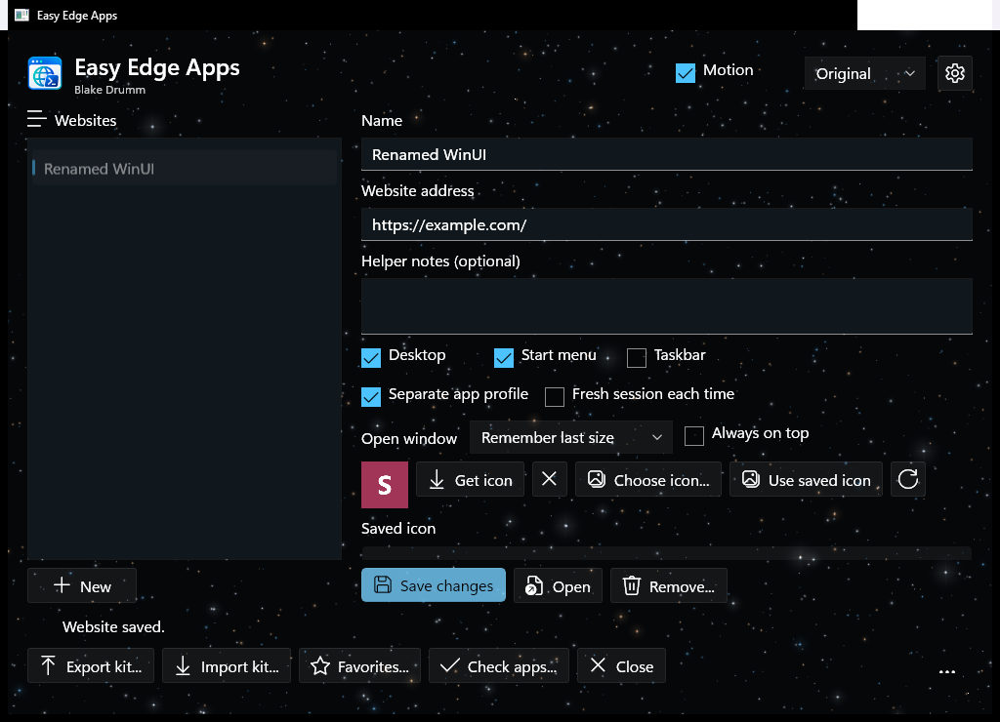
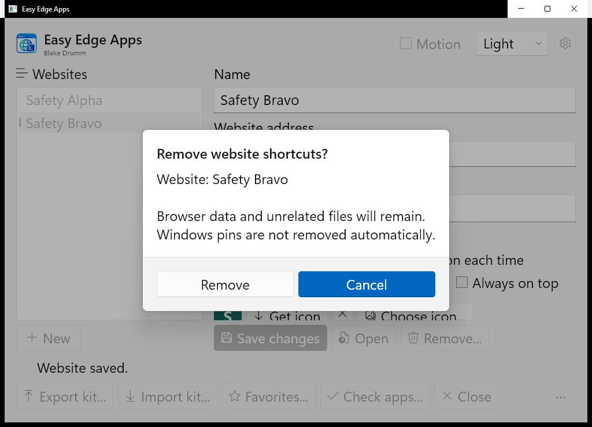
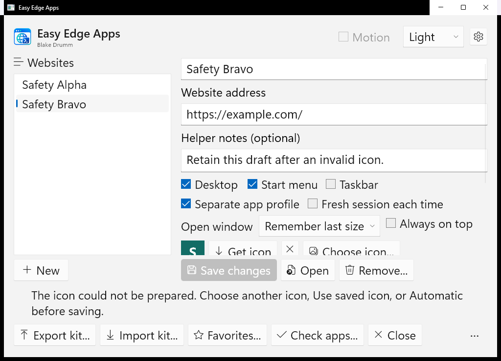
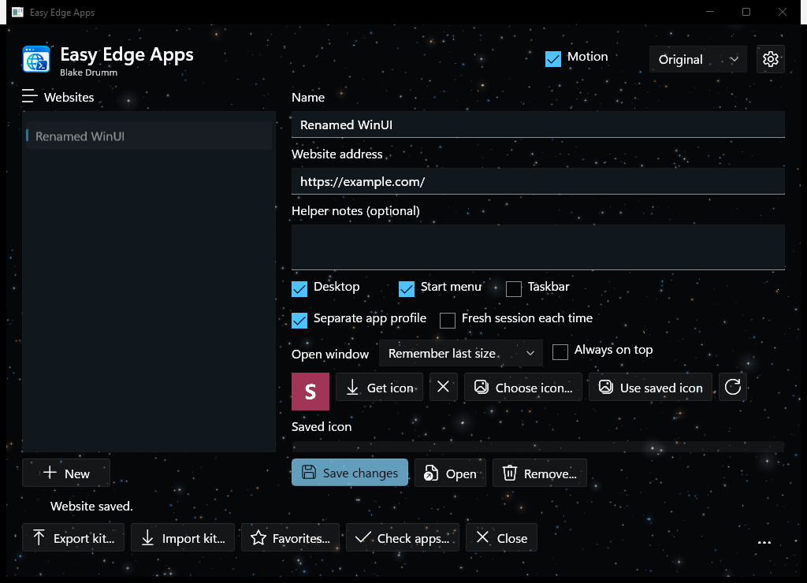
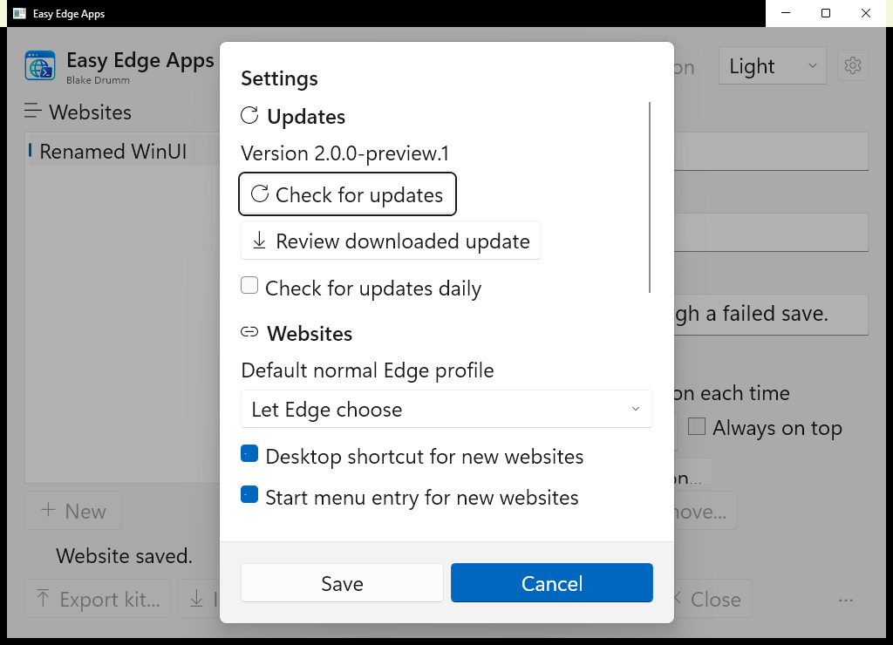
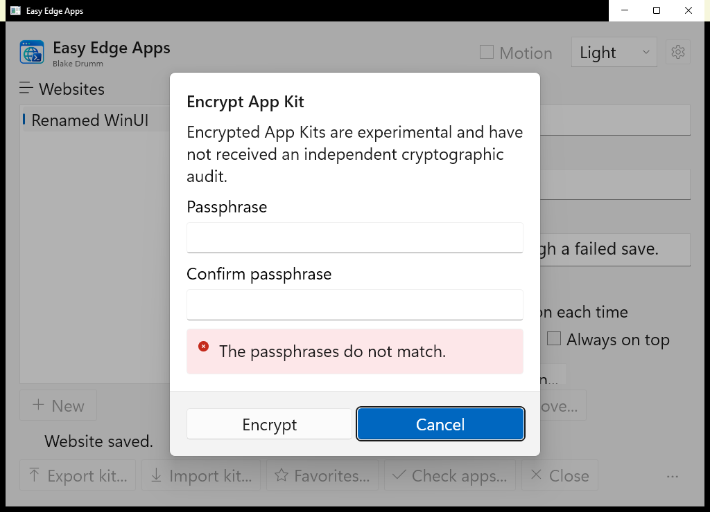
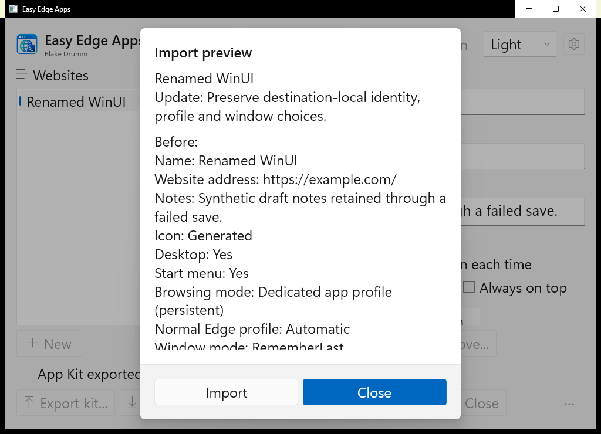
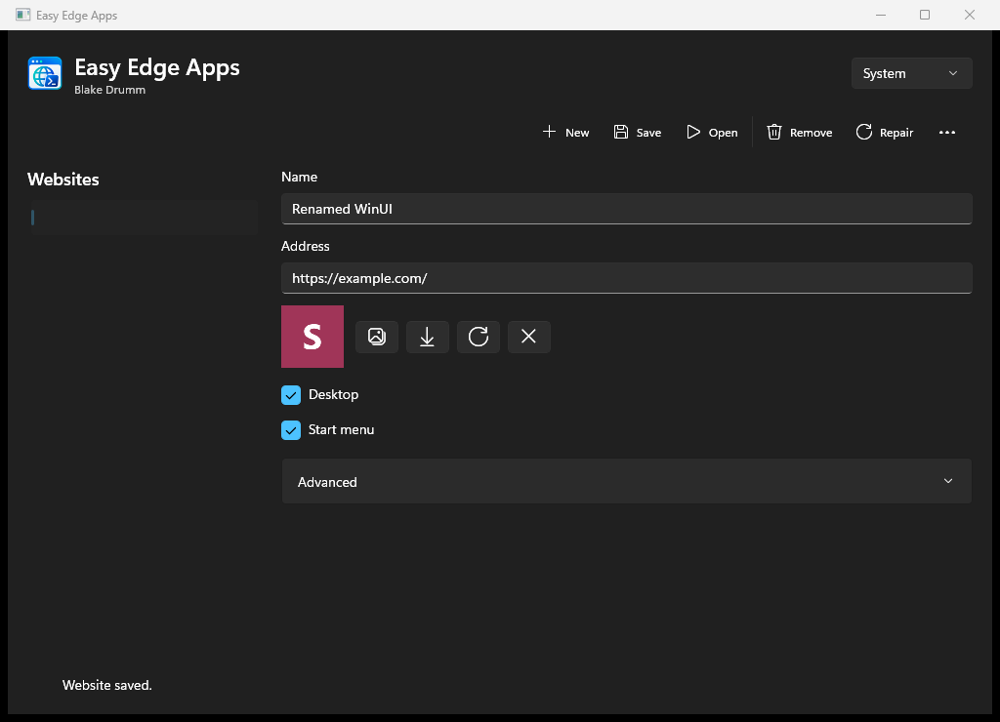
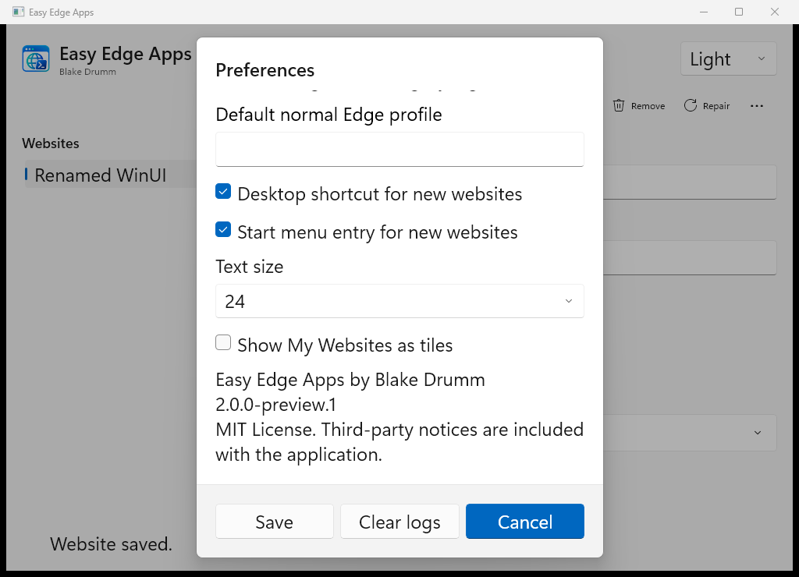
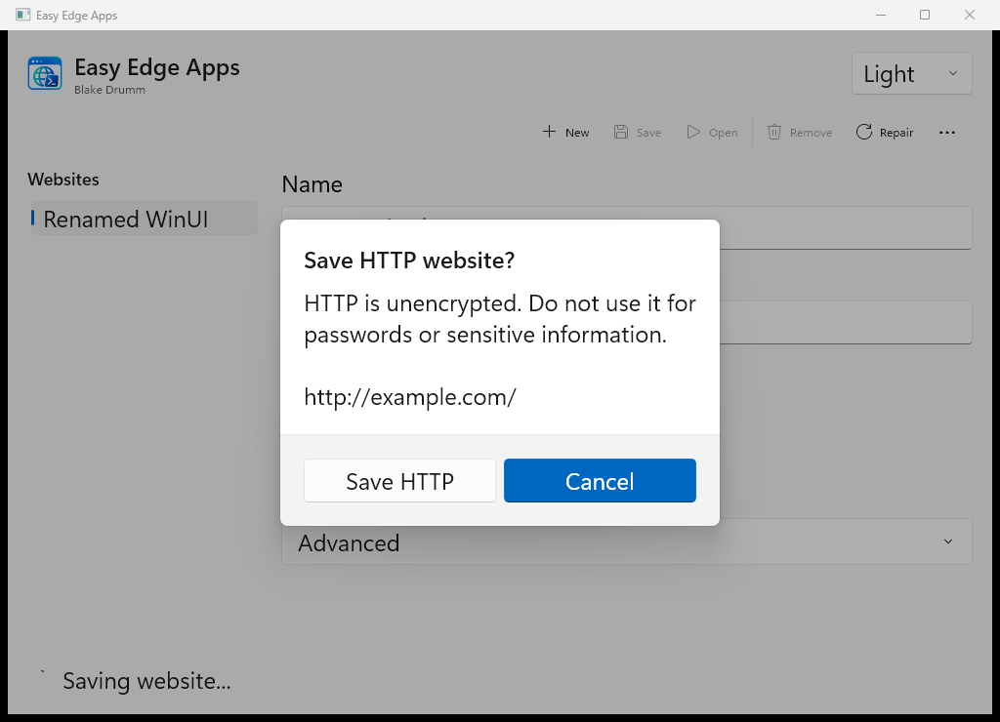

# Compiled Preview Validation: 2026-09-10

This is the local prepublication record for the `p4` payload released as [2.0.0 Preview 1](releases/v2.0.0-preview.1.md). Statements below about an uncommitted worktree, no publication and no remote CI describe that validation snapshot. The later authorized source/prerelease publication and tagged GitHub Actions runs are separate from the local results. Local `artifacts/` links are intentionally ignored development records; public downloads are on the [GitHub prerelease](https://github.com/blakedrumm/EasyEdgeApps/releases/tag/v2.0.0-preview.1), and versioned screenshots are included in this repository.

Publication follow-up: the first [compiled GitHub run](https://github.com/blakedrumm/EasyEdgeApps/actions/runs/34510417803) failed with `NU1004` because broad SDK roll-forward selected ILLink 10.0.12 instead of the locked 10.0.11. The [retained Windows run](https://github.com/blakedrumm/EasyEdgeApps/actions/runs/34510417766) passed, including legacy MSI lifecycle on its disposable runner; that is not compiled MSI acceptance. The SDK and both setup actions now use the exact tested SDK 10.0.303. The same locked solution restore and structured workflow checks passed locally without changing lockfiles or production binaries. Subsequent GitHub results remain separate from the local evidence below.

**Result: the current test, build and published-UI gates pass, but the app is not production-ready or a completed one-for-one migration.** The original PowerShell distribution remains present. Live migration/rollback is disabled, and the [parity matrix](Compiled-Preview.md#parity-and-evidence) identifies unfinished implementation as well as external acceptance requirements. The new readiness pass fixed reproduced data-safety, editor, parsing and native-lifetime defects; it does not substitute synthetic tests for real Windows acceptance. Existing retained-script analyzer errors remain visible below.

The repository baseline is main/v1.4.0 at `14d6cea3a88febeb296c0eccfd883d8ea92e25e0`. This report covers uncommitted working-tree changes on top of that baseline. No branch, commit, push, publication, MSI installation, real Edge launch, real profile modification, taskbar pin, or credential access was performed.

## Current Delivery: p4

The current runnable record is [p4/build-result.json](../artifacts/p4/build-result.json). It supersedes `p3`, `p2` and `compiled-delivery`, which are preserved as historical evidence. They share the engineering version `2.0.0-preview.1`; use the exact record and hashes. No production source change followed the `p4` build. The documentation and versioned capture copies were updated afterward.

| Current artifact | Size | SHA256 |
| --- | --- | --- |
| [Unsigned x64 ZIP](../artifacts/p4/EasyEdgeApps-2.0.0-preview.1-x64.zip) | 165,224,630 bytes | `d411d0ba84dd5a95ef6d2f087a877e7708adf5f16e068dc1d0754916c953a7aa` |
| [Unsigned per-user x64 MSI](../artifacts/p4/EasyEdgeApps-2.0.0-preview.1-x64.msi) | 135,539,453 bytes | `6c437e28f78c794851821c9bfc3f1d1e7f8813f81a19b8bde51d8d5266630946` |

The complete portable folder is 427,222,548 bytes. The self-contained .NET 10 website launcher is 141,518,994 bytes per site; the retained Framework target now measures 48,128 bytes. The distribution still selects .NET 10 to avoid a separately installed runtime. Backups can retain additional full launchers; no pruning was introduced. **Checksums are integrity checks, not publisher authentication. Do not install this MSI on the development account.**

Run the actual compiled manager using separate synthetic state:

```powershell
$build = Get-Content .\artifacts\p4\build-result.json -Raw | ConvertFrom-Json
& (Join-Path $build.PortableDirectory 'EasyEdgeApps.Manager.exe') `
	--isolated-root (Join-Path $PWD 'artifacts\p4-manager-data')
```

Keep the entire portable folder together, including XBF, PRI, runtime and Windows App SDK files. Isolated mode blocks actual browser, network, pin and installer operations. The PowerShell distribution remains in the payload with the import-validation and matching native-cleanup fixes.

## Current Executed Gates

| Evidence | Outcome | Retained result |
| --- | --- | --- |
| AUTOMATED, full Core/Persistence | 182 passed, zero failed | [core-readiness-final.trx](../artifacts/readiness-tests/core-readiness-final.trx) |
| WINDOWS/PACKAGE, full serialized Windows project | 84 passed, one explicit topmost skip, zero failed | [windows-readiness-final.trx](../artifacts/readiness-tests/windows-readiness-final.trx) |
| AUTOMATED, retained PowerShell | All 19 suites passed in each host: 38 suite runs | [legacy-readiness-p4/results.json](../artifacts/legacy-readiness-p4/results.json) |
| WINDOWS, exact published 16 DIP/Original | Complete UI and protected-kit file round trip passed | [default observations](../artifacts/readiness-ui-p4-default/observations.json) |
| WINDOWS, exact published 24 DIP/Light | Complete UI and protected-kit file round trip passed | [large-text observations](../artifacts/readiness-ui-p4-large/observations.json) |
| WINDOWS, published safety at 16 and 24 DIP | Busy selection lock, named Remove, cancelled-operation preservation, blocked icon Save and retained-note recovery passed | [default safety](../artifacts/readiness-ui-p4-safety-default/observations.json), [large-text safety](../artifacts/readiness-ui-p4-safety-large/observations.json) |
| WINDOWS, published Favorites at 24 DIP | Profile default, exclusions, placements, preview cancellation and approved new-only import passed | [Favorites observations](../artifacts/readiness-ui-p4-favorites/observations.json) |
| WINDOWS, published legacy-14-point Settings | Exact font mapping, validation, draft retention, save/reopen/cancel and defaults passed | [Settings observations](../artifacts/readiness-ui-p4-settings/observations.json) |
| WINDOWS, published window choices at 24 DIP | Taskbar dependencies, owned-window transitions and all compact controls reachable | [window observations](../artifacts/readiness-ui-p4-windows/observations.json) |
| WINDOWS, published System appearance | Animated pixels, stable pause, resume and persistence passed | [appearance observations](../artifacts/readiness-ui-p4-appearance/observations.json) |
| AUTOMATED/PACKAGE, complete build | Locked restore, native/starfield verification, brand pixels, both launcher targets, legacy build, 29 notice inventories, indexed ZIP, unsigned MSI and hashes passed | [build log](../artifacts/readiness-build.log), [p4 record](../artifacts/p4/build-result.json) |

These are eight sequential published UI runs. Both complete workflows include actual Save/Open picker cancellation, encrypted export, wrong-password retry, correct unlock, preview and matching import with catalog/source bytes unchanged. The picker and safety modes remain opt-in outside CI. The earlier meaningful protected-kit cancellation mutation is retained in the historical `p3` evidence below.

The Windows package tests inspect the exact indexed folder and ZIP, published XBF/PRI, read-only MSI metadata and actual rejection by the unsigned-publisher gate. Both MSI tests now use the selected build record and reject a conflicting `EEA_COMPILED_MSI`. This is not MSI execution, a signed positive path, or proof that an old selected record matches later source edits. Individual TRX results confirm the explicit topmost skip; aggregate counters alone were not used. Core and Windows totals overlap because transaction tests are linked into both projects.

Execution used .NET SDK 10.0.303/runtime 10.0.11, Windows PowerShell 5.1.26100.8875 and PowerShell 7.6.6. No remote CI was run. The earlier source-only clean build and structured workflow checks remain historical; `p4` performed locked restore/build/publish from this checkout.

## Final Repository Audit

The tracked diff was reviewed and `git diff --check` passed. All 106 new text files were checked for conflict markers/trailing whitespace, and the 12 changed/new PowerShell scripts parsed on 7.6.6. Touched compiled source, tests, XAML, GUI harness and guides had no reported editor errors. Local documentation links, PowerShell examples and distinct current/historical headings passed checks. Native and starfield extraction verification passed again, and the packaged PowerShell script is byte-identical to current source. ZIP/MSI hashes and all eleven screenshot copies were rechecked.

PSScriptAnalyzer 1.25.0 is **not clean** on the retained script: committed source has 296 diagnostics and current source has 297, including the same three `PSAvoidUsingConvertToSecureStringWithPlainText` errors and 139 automatic-variable warnings. A same-mode, occurrence-aware comparison found only the new non-gating `PSUseSingularNouns` warning for `Assert-EeaWindowSettings`; no new analyzer errors or suppressions were introduced. An initial audit command incorrectly rejected all existing errors and compared filename-dependent `-Path` messages to `-ScriptDefinition`; its failure was an audit-classification problem, not repaired production code. The existing plaintext-conversion findings still require security judgment alongside the documented managed-memory and encryption-audit limits.

No repository-owned GUI-test process or `winui-test-*` directory remained at the final check. Free C: space was 2,756,259,840 bytes at that observation. No source cleanup, package overwrite, real-profile operation, installation, signing, commit or remote write was used to obtain a pass.

## Readiness Fixes and Failure Evidence

| Confirmed finding and change | Discriminating evidence |
| --- | --- |
| Catalog commits could exceed their own reader limits. Commit now validates the 16 MiB, 5,000 retained-identity, depth and value bounds before any owned-file transaction. No tombstones were pruned. | [Capacity red](../artifacts/readiness-tests/catalog-capacity-red.trx), [green](../artifacts/readiness-tests/catalog-capacity-green.trx); unchanged catalog hash and no new artifacts required. |
| An oversized journal could create unreadable recovery state, and recovery could overwrite a file changed after preflight. Journal serialization is bounded before creating state; each restore and staged replacement rechecks expected ownership. | [Two transaction failures](../artifacts/readiness-tests/transaction-readiness-red.trx), [20 passing transaction cases](../artifacts/readiness-tests/transaction-readiness-green.trx). A synchronized external edit is preserved. These are not atomic compare-and-swap or power-loss guarantees. |
| Rollback left owned shortcuts enabled only after migration. It now removes those slots using their recorded hashes while restoring original bytes and retaining browser data. | [Two rollback failures](../artifacts/readiness-tests/migration-shortcut-red.trx), [44 passing catalog/migration cases](../artifacts/readiness-tests/catalog-migration-readiness-green.trx). Live migration stays disabled. |
| Malformed release asset objects and size fields escaped as runtime exceptions. They now fail explicit validation before downloading. | [Six wrong-exception failures](../artifacts/readiness-tests/update-metadata-red.trx), [19 passing update cases](../artifacts/readiness-tests/update-metadata-green.trx); offline responses only. |
| Explicit Favorites name selection rejected valid selected entries because unrelated excluded titles were invalid. Only usable candidate keys participate in matching; requested names and source parsing stay strict. | [Three actual CLI failures](../artifacts/readiness-tests/favorites-selection-red.trx), [four passing cases](../artifacts/readiness-tests/favorites-selection-green.trx); synthetic Bookmarks unchanged. |
| Busy selection was not locked, Remove did not identify its exact saved target, and icon failures left misleading Save affordances. The manager locks selection, captures and names the immutable target, blocks both Save routes on icon failure and offers draft-preserving recovery. | [Five intended UI assertion failures](../artifacts/readiness-ui-safety-red3/), [development pass](../artifacts/readiness-ui-safety-green/observations.json), both published safety passes above. No wrong-target deletion of user data was performed. |
| The controller borrowed a caller-owned job handle. It now owns a duplicate until its worker exits. Because duplicate handles can keep a job alive, launcher failure also explicitly terminates only its successfully assigned job. | [Handle red](../artifacts/readiness-tests/controller-handle-red.trx), [retained-handle child-termination red](../artifacts/readiness-tests/controller-job-termination-red.trx), [11 passing native cases](../artifacts/readiness-tests/controller-job-termination-green.trx). Rejected duplicate launches leave the existing job alive. Embedded and compiled source match. |
| Taskbar cancellation killed but did not await its owned helper. It now awaits exit before returning cancellation. | The old code [passed the timing test](../artifacts/readiness-tests/pin-cancellation-before.trx), so a delayed-exit race was not reproduced. A [no-termination mutation failed](../artifacts/readiness-tests/pin-cancellation-mutation-red.trx); restoration plus explicit wait [passed](../artifacts/readiness-tests/pin-cancellation-green.trx). The helper is synthetic and never contacts the taskbar. |
| Independent MSI overrides could mix package evidence. Both checks now share the selected build-record reader and reject a conflicting override. | [Mismatch red](../artifacts/readiness-tests/package-binding-red.trx), [green](../artifacts/readiness-tests/package-binding-green.trx), then full Windows against `p4`. Earlier `p3` runs explicitly bound both paths and were not invalidated. |

The first full Core run had 181 passes and a fixture-cleanup exception involving a live staged writer: [initial Core result](../artifacts/readiness-tests/core-readiness-full.trx). The contention test now waits for actual stage creation, releases the reader and always joins the writer before deleting its fixture. Its [20-case slice passed](../artifacts/readiness-tests/transaction-lifetime-green.trx), followed by the full 182-case gate. This fixes test lifetime and failure masking; it does not diagnose the earlier scheduling/I/O latency or change production retry bounds.

The first current Windows run had 79 passes, five failures and the explicit topmost skip: [failed full result](../artifacts/readiness-tests/windows-readiness-full.trx). One failure explicitly reported disk exhaustion while staging the 141 MB launcher; four CLI failures returned safe generic errors. C: had only 236,298,240 free bytes. Removing only inspected, untracked manager/shared-library build outputs and `p4` WiX cabinets restored 1.66 GB; every portable folder, ZIP/MSI, build record, screenshot and failed result was preserved. With no production edit, [all six cases in the affected slice passed](../artifacts/readiness-tests/windows-readiness-capacity-recheck.trx), followed by the full 84-pass/one-skip run. This supports capacity as the cause of the generic failures but does not recover an individual exception for each. A 1.5 GB pre-build estimate was inadequate for build plus subsequent tests; allow several GiB and measure actual free space.

Two early safety runs failed on selectors before reaching the assertions. The harness now requires an invokable named control and uses the existing Remove button's stable automation ID. Only the third run reached all five intended failures. Neither those selector failures nor historical unrelated UIA deadlines count as regression sensitivity. All deliberate production mutations have been restored.

## Readiness Review Disposition

Five fresh Tier 4 read-only experts returned; no nested review was used, and runtime model-family independence is unverified. The coordinator applied changes and ran the tests, rather than treating agreement as evidence.

- The implementation review identified the editor/Remove/icon safeguards and Favorites selection defect; actual GUI and CLI tests confirmed them.
- The durable-data review identified catalog/journal bounds, late recovery ownership and post-migration shortcut rollback; focused failing/passing tests confirmed them. An alias-overflow concern was rejected after checking normalization.
- The security review identified malformed update metadata. Its SVG-root concern was rejected: the source uses `XDocument.Descendants`, and an executed XML probe included the root and its event attribute. No sanitizer weakening was made.
- The testing review identified conflicting MSI selection. The claims of absent legacy CI coverage and no normal GUI shutdown were rejected by reading both workflow triggers and the harness's normal close/wait path. The topmost skip was already explicit.
- The native review identified the borrowed handle and missing awaited helper exit. Its stale-error concern was rejected by a same-thread native probe: new named jobs returned error 0, existing jobs 183, with managed last-error clearing disabled. Named-app polling remains 250 ms to discover later windows; its long-running real-Edge cost is unmeasured.

The detailed changes, tests and boundaries are in [architecture](Compiled-Architecture.md) and [acceptance](Compiled-Acceptance.md). None of these source or synthetic conclusions establishes live production readiness.

## Current Captures and Cost

Eleven versioned images are exact SHA256-checked copies from the published `p4` executable with synthetic data. Editor, compact layout, Settings, Favorites, encryption, Remove and icon-recovery captures were visually inspected. Scrollable content is intentionally clipped at the viewport; fixed commands do not overlap it.







[Enlarged Settings](images/compiled/p4-preferences-large.png), [compact editor](images/compiled/p4-compact-large.png), [encrypted validation](images/compiled/p4-encrypted-validation-large.png), [Favorites preview](images/compiled/p4-favorites-preview-large.png), [disabled Favorites candidates](images/compiled/p4-favorites-candidates-large.png), [protected import](images/compiled/p4-protected-import-large.png), [Check Apps](images/compiled/p4-check-apps.png) and [HTTP confirmation](images/compiled/p4-http-confirmation-large.png) retain the other states.

| Measurement | 16 DIP/Original | 24 DIP/Light |
| --- | --- | --- |
| Startup | 1,310 ms | 915 ms |
| First save | 2,874 ms | 3,708 ms |
| Rename | 1,406 ms | 912 ms |
| Working set | 276,508,672 bytes | 240,128,000 bytes |
| Peak working set | 661,307,392 bytes | 656,527,360 bytes |
| Editor/Settings UIA font | 12 / 16 | 18 / 24 |
| Confirmation UIA font | 16 | 24 |

These individual workflows are not benchmarks, performance parity or clean-machine measurements. Approximately 626-631 MiB peak, multi-second saves and 135 MiB per-site launchers remain material costs. Zero timing/memory fields in focused observations mean uncollected, not zero use. TextBox and TextBlock UIA providers report different font units.

## Current Remaining Acceptance

**BLOCKED/UNVERIFIED:** cross-session predecessor exclusion; real compiled Edge Shared/Dedicated/Fresh profiles, account continuity, later windows, full-screen/Escape and shutdown; actual pin/grouping/rename/unpin; topmost; MSI install/upgrade/repair/uninstall and older rollback; runtime-free clean Windows; physical mixed DPI, high contrast/reduced motion, exhaustive keyboard and spoken Narrator/NVDA acceptance; trusted Authenticode/timestamp positive, signed portable lifecycle and Later resume; independent encryption and legal audit; broader power-loss and concurrent filesystem substitution acceptance.

The retained distribution also keeps its three pre-existing plaintext-to-SecureString analyzer errors and the unsuppressed warning baseline described in the final audit. Passing compatibility tests is not a security sign-off for those findings.

**PROHIBITED HERE:** real profiles/browser acceptance, shell pin requests, installed-product changes, signing credentials, publication, pushes and merges. Live migration/rollback stay disabled and the production publisher pin stays empty. The repository does not yet contain a complete compiled real-Edge/cross-session/installed-product acceptance harness; the retained legacy browser tests are references, not successor acceptance. Use the [external acceptance matrix](Compiled-Acceptance.md#external-acceptance-matrix) for exact targets.

Historical File.Replace error 1175, a separate filesystem move/access failure, earlier UIA/input failures and unexplained crypto latency remain open despite later passes. Some ICO preview remains in-process, helper jobs are not security sandboxes, managed strings are not securely erasable, and support counts use lower-level hash inspection rather than full native checks. The sections below preserve earlier reports as history, not current delivery or sign-off.

## Historical p3 Delivery

The historical runnable record is [p3/build-result.json](../artifacts/p3/build-result.json). It superseded `compiled-delivery` and `p2` at that handoff, before the readiness fixes in `p4`. All retain engineering version `2.0.0-preview.1`; use record and checksums. At the `p3` handoff no lasting production source change had followed its build; subsequent parity work involved test isolation, diagnostics, picker acceptance and documentation. Its temporary cancellation mutation was restored and rebuilt without changing that published payload.

| Current artifact | Size | SHA256 |
| --- | --- | --- |
| [Unsigned x64 ZIP](../artifacts/p3/EasyEdgeApps-2.0.0-preview.1-x64.zip) | 165,222,755 bytes | `1ad7cf4dc1309785faa7c9f0bf28c7831a589bbe450134c180f552b5421f6900` |
| [Unsigned per-user x64 MSI](../artifacts/p3/EasyEdgeApps-2.0.0-preview.1-x64.msi) | 135,555,837 bytes | `867a2936705ca85f73bad0cd3eca5567a172b5bdbe7a0fe9fe3f1e28d3e904b5` |

The complete portable folder is 427,216,088 bytes. Its self-contained website launcher is 141,518,994 bytes per site. The Framework target remains 47,616 bytes, but the selected distribution uses .NET 10 to avoid a separately installed runtime. Full retained backups add storage; there is no automatic pruning. **Checksums are integrity checks, not publisher authentication. Do not install this MSI on the development account.**

Run the actual C# GUI from this checkout with an isolated repository-local root:

```powershell
$build = Get-Content .\artifacts\p3\build-result.json -Raw | ConvertFrom-Json
& (Join-Path $build.PortableDirectory 'EasyEdgeApps.Manager.exe') `
	--isolated-root (Join-Path $PWD 'artifacts\p3-manager-data')
```

Keep the entire portable folder together. XBF, PRI, runtime and Windows App SDK files are required. Isolated mode blocks actual browser/network/pin/installer operations. The original PowerShell distribution remains in the payload.

## Historical p3 Executed Gates

| Evidence | Outcome | Retained result |
| --- | --- | --- |
| AUTOMATED, full current Core/Persistence | 171 passed, zero failed | [core-p3-full.trx](../artifacts/parity-tests/core-p3-full.trx) |
| WINDOWS/PACKAGE, full serialized Windows project | 75 passed, one explicit topmost skip, zero failed | [windows-p3-serialized-full.trx](../artifacts/parity-tests/windows-p3-serialized-full.trx) |
| AUTOMATED, retained PowerShell distribution | 19 suites in each host, 38 passes, zero failures | [legacy-parity-p3/results.json](../artifacts/legacy-parity-p3/results.json) |
| WINDOWS, exact published default 16 DIP/Original | Full synthetic GUI workflow passed | [default observations](../artifacts/parity-ui-p3-default/observations.json) |
| WINDOWS, exact published 24 DIP/Light | Full synthetic GUI workflow passed | [large-text observations](../artifacts/parity-ui-p3-large/observations.json) |
| WINDOWS, published Favorites at 24 DIP | Profile default, exclusions, collision-safe names, placements, before/after comparison, cancelled-preview retention and approved import passed | [Favorites observations](../artifacts/parity-ui-p3-favorites/observations.json) |
| WINDOWS, published Settings with legacy 14-point input | Exact font mapping, profile/defaults, validation/tool draft retention, save/reopen/cancel passed | [Settings observations](../artifacts/parity-ui-p3-settings/observations.json) |
| WINDOWS, published window choices at 24 DIP | Taskbar dependencies, owned-window transitions and complete compact control reachability passed | [window observations](../artifacts/parity-ui-p3-windows/observations.json) |
| WINDOWS, published System appearance | Actual animated pixels, pause stability, resume and persistence passed | [appearance observations](../artifacts/parity-ui-p3-appearance/observations.json) |
| WINDOWS, published protected-kit workflow, 16 DIP/Original and 24 DIP/Light | Actual save-picker cancellation, encrypted export, wrong-password retry, correct unlock, preview and unchanged-data import passed | [default round trip](../artifacts/parity-ui-p3-kit-files-roundtrip/observations.json), [large-text round trip](../artifacts/parity-ui-p3-kit-files-roundtrip-large/observations.json) |
| WINDOWS, focused protected-kit regression | Published and restored development workflows passed; cancellation mutation failed at the intended lost-draft assertion | [published focused result](../artifacts/parity-ui-p3-kit-files-focused/observations.json), [mutation log](../artifacts/parity-ui-kit-files-cancel-focused-mutation.log), [restored result](../artifacts/parity-ui-kit-files-focused-restored/observations.json) |
| AUTOMATED/PACKAGE, complete current build | Locked restore, native/starfield extraction, brand pixels, both launcher targets, retained legacy build, 29 package notice inventories, indexed ZIP, unsigned MSI and hashes passed | [p3 build record](../artifacts/p3/build-result.json) |
| AUTOMATED, CI structure | Structured YAML plus four PowerShell run blocks in seven steps passed; remote CI not run | [compiled.yml](../.github/workflows/compiled.yml) |

The full Windows gate includes exact indexed folder/ZIP hashes, published XBF/PRI, read-only MSI metadata, real unsigned-publisher rejection and both launcher targets. It does not execute MSI or Edge. Core and Windows totals overlap because transaction tests are linked into both projects; do not add them as unique cases. The old full 119/57 and intermediate 161/67 counts below are not current-source acceptance.

The current retained gate used PowerShell 7.6.6 and Windows PowerShell 5.1.26100.8875. Compiled execution used SDK 10.0.303/runtime 10.0.11. The previous source-only clean build is historical evidence; `p3` performed current locked restore/build/publish without an additional source-only clone.

The final audit parsed all 12 changed/new PowerShell scripts, passed `git diff --check`, and checked 105 new text files for conflict markers and trailing whitespace. The tracked changes and new-file inventory were reviewed; touched compiled/test files had no reported editor diagnostics. The 139 legacy automatic-variable warnings match committed source by rule, message and extent. A full analyzer comparison found one additional, non-gating `PSUseSingularNouns` warning for the new `Assert-EeaWindowSettings` helper; its descriptive name is retained and no diagnostic was suppressed. Published ZIP/MSI hashes were rechecked unchanged, and no owned GUI-test processes or `winui-test-*` fixture directories remained.

## Historical p3 Restored Behavior

- Editor-first original appearance, direct commands, exact predecessor text-size mapping and startup working-area fit now run in the actual published manager. The startup regression failed before centering was added.
- Website icon discovery retries decoder-invalid candidates and applies the resolved URL with generation-safe editor state. Named CLI saves preserve omitted choices; explicit fetch/reset/icon and Taskbar/pin commands are implemented. Isolated tests block network and real pin effects. A successful save remains successful if later pin approval fails.
- Favorites now has profile/refresh/placement/selection controls and visible disabled entries. Candidate names reserve aliases, tombstones, shortcut paths and legacy folders. New-only mode is approval-bound; mutations produced `Update` and duplicate-URL `Add` instead of `Conflict`, then passed after restoration: [mutation evidence](../artifacts/parity-tests/favorites-new-only-mutation-red.trx), [restored catalog suite](../artifacts/parity-tests/favorites-new-only-restored.trx).
- Kit preview shows current/effective values and preflights unowned shortcut destinations before any selected writes. Five matching-kit cases initially failed to repair missing owned slots; the import now uses the same verified missing-slot adjustment as Repair: [failing cases](../artifacts/parity-tests/kit-missing-artifacts-red.trx), [passing catalog checks](../artifacts/parity-tests/kit-missing-artifacts-green.trx).
- Four actual CLI forced exports initially overwrote synthetic source/managed/shortcut targets. Shared export-path validation now rejects those paths and preserves bytes: [failing cases](../artifacts/parity-tests/export-protected-paths-red.trx), [passing checks](../artifacts/parity-tests/export-protected-paths-green.trx).
- Native Check Apps inspects owned hashes, ICO/configuration/shortcut metadata, current Edge path and bundled launcher, and reports unowned successor folders without adoption. Healthy/conflicted/runtime rows are disabled for repair. Actual GUI tests verify stale-inspection rejection, missing-shortcut repair and retained synthetic browser-data preservation.
- Blank/mismatched encryption input formerly dismissed the dialog. Actual default/large-text regressions now retry in the same protected controls, clear temporary buffers and return cancelled encryption to the retained export draft. Managed strings and UI controls are not a secure-erasure guarantee.
- Actual protected-kit file workflows now pass at 16 and 24 DIP. Cancelling Save preserves kit name, notes and selection without writing a file. Successful export has the encrypted envelope and 600,000 iterations, with no checked plaintext kit fields. Wrong-password retry stays in the unlock dialog; correct unlock, preview and matching-kit import preserve catalog and encrypted source bytes. A temporary early return after picker cancellation failed specifically at `Cancelling the actual save picker lost the export draft.`; restoration passed the same focused test.
- Portable CLI validates exact required record fields and isolated paths before inspection, uses real publisher verification and requires explicit writes. Mock-publisher activation/recovery/rollback tests do not establish a signed positive path.

The first `p3` Windows run failed with one shared-writer mutex collision and two 90-second PowerShell 5.1 interoperability timeouts: [first full result](../artifacts/parity-tests/windows-p3-full.trx). Serializing Windows test classes removed the collision but not the timeouts: [serialized recheck](../artifacts/parity-tests/windows-serialized-recheck.trx). A diagnostic run loaded the legacy script in 125 ms and decrypted in 51,054 ms before the deadline: [stage failure](../artifacts/parity-tests/crypto-stage-deadline.trx). The two-direction worker alone now has a three-minute bound and retains safe output; ordinary commands remain bounded at 90 seconds. A passing 120.97-second case reported 52,082 ms decrypt and 4,707 ms encrypt, which does not account for the entire delay: [bounded result](../artifacts/parity-tests/crypto-stage-bounded-pass.trx). Latency remains unexplained; no production cryptography, iteration count or lock was changed.

Picker harness failures were not application-regression evidence. This host exposed Save/Cancel as UIA panes, a read-only or absent filename ValuePattern, and different native Save/Open filename hierarchies. The final harness verifies exact dialog ownership, native classes, filename ancestry and path read-back, then queues the specific button click and waits for closure and application results. Cross-process Edit read-back uses bounded `WM_GETTEXT`; synchronous native Save had timed out with error 1460. No global keyboard/mouse input or real data was used. These selectors are English-Windows acceptance, not locale-independent accessibility coverage, and remain opt-in rather than part of CI.

Two earlier full-workflow mutation runs failed before the relevant assertion (transient null viewport and overall deadline). A restored full development run also stopped before the picker with an unexpected name edit. None establishes cancellation sensitivity. The focused fixture exposed and fixed its own initial Save-readiness race, then provided the specific mutation failure and restored pass linked above. Intermittent earlier full-workflow provider/input failures remain recorded, not explained by that local readiness fix.

## Historical p3 Captures and Cost

These are exact, hash-checked copies from the published `p3` process with synthetic data. Earlier capture files are retained separately.









[Before/after import preview](images/compiled/p3-favorites-preview-large.png), [scrolled Favorites and disabled entries](images/compiled/p3-favorites-candidates-large.png), [native Check Apps](images/compiled/p3-check-apps.png), [compact enlarged editor](images/compiled/p3-compact-large.png), and [HTTP confirmation](images/compiled/p3-http-confirmation-large.png) show additional actual states. Scrollable content need not fit simultaneously; primary commands remain separate from it.

| Measurement | 16 DIP/Original | 24 DIP/Light |
| --- | --- | --- |
| Startup | 1,099 ms | 796 ms |
| First save | 1,359 ms | 4,283 ms |
| Rename | 979 ms | 970 ms |
| Working set | 412,909,568 bytes | 235,376,640 bytes |
| Peak working set | 663,093,248 bytes | 653,668,352 bytes |
| Editor/Settings UIA font | 12 / 16 | 18 / 24 |
| Confirmation UIA font | 16 | 24 |

These are individual observed workflows, not benchmarks or performance parity. The approximately 623-632 MiB peak and 135 MiB per-site launcher are material costs. TextBox and TextBlock UIA providers report different font units. Zero save/memory fields in focused-workflow observation files mean those measurements were not collected, not zero resource use.

## Historical p3 Remaining Acceptance

The [external acceptance matrix](Compiled-Acceptance.md#external-acceptance-matrix) remains required. Cross-session predecessor exclusion is not proven, so live migration/rollback stay disabled. No real compiled Edge profile/window/shutdown, actual pin/grouping, topmost, MSI lifecycle, runtime-free clean Windows, physical mixed DPI, spoken screen-reader, signed publisher/timestamp positive or independent cryptographic/legal acceptance is claimed.

Protected-kit Save/Open workflows are established for synthetic data on this English Windows host at default and enlarged text. Exhaustive dialog keyboard coverage, other picker locales/provider versions and spoken accessibility are not established. Native inspection covers successor unowned folders; legacy migration inventory and corrupt-catalog recovery remain separate. Support counts still use lower-level hash inspection. Historical File.Replace error 1175, a separate filesystem move/access failure, intermittent full-workflow UIA/input failures and observed crypto latency remain undiagnosed despite subsequent passes. The following sections retain the earlier report as history, not as current delivery or acceptance.

## Historical Delivery Artifacts

The earlier artifact record is [compiled-delivery/build-result.json](../artifacts/compiled-delivery/build-result.json). It is retained for comparison, not the current runnable recommendation.

| Artifact | Size | SHA256 |
| --- | --- | --- |
| [Unsigned x64 ZIP](../artifacts/compiled-delivery/EasyEdgeApps-2.0.0-preview.1-x64.zip) | 165,159,773 bytes | `952b56afc6db46ba46244d976a7e456cfcd68bcf3183de5e4b0a2aa7c31d6f8d` |
| [Unsigned per-user x64 MSI](../artifacts/compiled-delivery/EasyEdgeApps-2.0.0-preview.1-x64.msi) | 135,547,645 bytes | `56332d0582ca001fce0ad3485363697b55da201df7aa102fd0825d657163ef09` |

Unpacked payload: **427,056,875 bytes**, approximately 407 MiB. Per-site self-contained launcher: **141,518,994 bytes**, 134.96 MiB per site. The retained Framework target is 47,616 bytes, but the compiled distribution selects .NET 10 to avoid a separately installed runtime. Transaction backups can retain additional launcher copies; no backup-pruning policy is implemented.

These hashes provide integrity comparison only. They are not publisher authentication. The default production publisher pin is empty. Actual unsigned ZIP/MSI verification was rejected by the real trust gate; no positive trusted/timestamped package was available.

The package build performed locked solution restore, native-source verification, original-brand generation, both launcher targets, self-contained manager/CLI/worker publish, retained legacy build, 29 exact package notice inventories, complete embedded payload index, ZIP, WiX MSI validation, and checksums. MSI was read for metadata, never installed. The complete folder and every indexed ZIP file were checked; full MSI lifecycle and installed payload correspondence remain external acceptance.

## Historical Executed Gates

| Evidence | Outcome | Retained result |
| --- | --- | --- |
| AUTOMATED, full Core/Persistence/contracts | 119 passed, zero failed | [core-final.trx](../artifacts/compiled-tests-final/core-final.trx) |
| WINDOWS, full current Windows test project | 57 passed, one explicit topmost skip, zero failed | [windows-final.trx](../artifacts/compiled-tests-final/windows-final.trx) |
| PACKAGE, final delivery/maintenance slice | Five passed, zero failed | [delivery-package.trx](../artifacts/compiled-tests-final/delivery-package.trx) |
| AUTOMATED, retained PowerShell distribution | All 19 suites passed in both hosts: 38 suite runs, zero failed | [results.json](../artifacts/legacy-acceptance-final/results.json) |
| WINDOWS, exact published manager, default 14 DIP/System | Full synthetic UIA workflow passed | [observations](../artifacts/compiled-ui-delivery/observations.json) |
| WINDOWS, exact published manager, 24 DIP/Light | Full workflow plus actual editor/Preferences/HTTP font checks passed | [observations](../artifacts/compiled-ui-delivery-large/observations.json) |
| AUTOMATED/PACKAGE, source-only snapshot | 154 current source files copied without bin/obj/artifacts or generated branding; locked restore, all builds, ZIP and MSI completed from the shorter clean root | [clean build record](../artifacts/c/artifacts/p/build-result.json) |
| AUTOMATED, CI and documentation syntax | Structured compiled workflow YAML, six steps, three PowerShell blocks; compiled-guide links and examples checked | [compiled.yml](../.github/workflows/compiled.yml), [acceptance commands](Compiled-Acceptance.md) |

Core/Windows counts are not added as unique cases because transaction tests are linked into both projects. The full Windows result preceded the final manager-only typography/readiness fixes; those fixes were then built, tested through actual UI, packaged, and verified against the exact delivery payload. No Core, Windows integration, or native-controller change followed those full test results.

The source-only build also preceded the final dialog-sizing and WiX path-diagnostic edits. Those edits added no package dependencies or generated inputs; the final delivery was rebuilt and revalidated afterward. The tracked diff was reviewed and passed `git diff --check`; 96 new text files had no conflict markers. Touched-file diagnostics and the executed builds were clean. A source search found no runtime PowerShell hosting or C# source-compilation calls in the compiled projects.

The final retained-distribution run used PowerShell **7.6.6**; earlier focused/interoperability evidence used 7.6.5. Windows PowerShell was 5.1.26100.8875. The compiled gates used .NET SDK 10.0.303/runtime 10.0.11. No test result is inferred solely from an earlier run or an expert report.

## Historical Failure Evidence

- The required import-preview defect was reproduced on both hosts before the fix: Alpha changed before incompatible Bravo failed. Shared effective-window validation now reports `Update,Conflict` and `Not attempted,Conflict`; all selected owned hashes remain unchanged. False/omitted schema-2 Fresh, schema-1 preservation, FullScreen/topmost and Repair are covered.
- Missing published XBF/PRI resources caused WinUI fail-fast `0xC000027B`. A published-resource regression failed against the retained bad archive, and the explicit resource-publish target plus actual published UI passed.
- Catalog/journal required fields, custom-icon repair, migration archive completeness, address downgrade rules, opted-in CLI diagnostics and GIF/BMP conversion have recorded red/green cases. Native ownership, process-completion, Escape, placement, streamed-copy hash checking, decoder cancellation and decoder deadline have targeted mutation evidence.
- The eight image-worker cases include post-input cancellation, actual 20-second deadline expiry, and child-query verification of one-process/384 MiB/kill-on-close job settings. A leaked-child mutation and an extended-deadline mutation failed and were restored. Memory exhaustion itself was not directly forced; this remains resource containment, not a security sandbox.
- Final UI validation exposed transient null UIA elements during resize/modal closure and a command-readiness race. Polling now requires observable presence/enabled/status state, and the manager refreshes busy state before starting a command. Failed drafts and retry behavior remain checked.
- A screenshot exposed Preferences at 10.5 points despite a 24-DIP preference. The actual field-font test failed, and loaded popup-content sizing fixed it. A plain-text confirmation callback still raced; explicit loaded text content plus a measured-font wait resolved it. A mutation withholding plain-text sizing failed at the HTTP assertion. All temporary mutations were restored.
- The long clean snapshot reached a 261-character payload path and WiX's native cabinet process failed with `The pipe has been ended`. The shorter source-only build completed. The generator now rejects a payload source at 260 characters before invoking WiX and gives a short-path diagnostic. This is a supported path-boundary workaround, not a claim to have repaired WiX internals.
- The earlier File.Replace error 1175 remains undiagnosed. The controlled reader-lock test reproduced error 32, and bounded unchanged-hash retries passed; that different HRESULT does not establish the cause of 1175.
- Topmost remains unaccepted: both the controller and a direct successful native request left the observable flag unset on this hosted desktop. The test is skipped by default and requires explicit disposable-desktop acceptance with `EEA_TEST_TOPMOST=1`.

Earlier failing artifacts and misleadingly named `green` results are retained in [Migration-Progress.md](Migration-Progress.md). A filename is not a verdict. Broad mutation coverage of every newly added test has not been claimed.

## Historical Captures and Measurements

These are actual WinUI captures using synthetic data. Original branding is retained. No browser or global keyboard input was used. Capture copies were hash-checked against their originals.







[Compact large-text editor](images/compiled/compact-large.png) retains scrolling; not every control is expected to fit simultaneously in the compact viewport. The tests separately check default primary-action visibility and lower-control reachability.

| Measurement | Default 14 DIP/System | 24 DIP/Light |
| --- | --- | --- |
| Startup | 946 ms | 702 ms |
| First save | 6,662 ms | 4,797 ms |
| Rename | 2,866 ms | 2,895 ms |
| Working set | 215,977,984 bytes | 217,153,536 bytes |
| Peak working set | 483,213,312 bytes | 483,622,912 bytes |
| Editor/Preferences UIA font value | 10.5 / 10.5 | 18 / 18 |
| Confirmation TextBlock UIA font value | 14 | 24 |

These are two individual workflows on a development host, not comparative font benchmarks or clean-machine performance. TextBox and TextBlock providers report font values differently; actual captures and type-specific checks accompany those attributes. The approximately 461 MiB peak and multi-second save remain material costs. Streaming transaction copies avoids additional full launcher arrays, but template allocation, hashing and retained backups remain.

## Historical Remaining Work

This snapshot predates the restored parity work above. Its implementation-gap list is retained as history; use Current Remaining Acceptance for present limitations.

The [external acceptance matrix](Compiled-Acceptance.md#external-acceptance-matrix) names the exact targets and evidence required. Remaining implementation includes portable activation/rollback, persisted Later-resume, full predecessor preference/appearance mapping, and complete compiled CLI/accessibility parity. The original PowerShell entry point remains available for its existing features; it is not proof that the new CLI is a drop-in replacement.

BLOCKED/UNVERIFIED: cross-session old-writer exclusion; real compiled Edge Fresh/Persistent/fullscreen/Escape/shutdown; actual pin/grouping/rename continuity; physical mixed DPI, high contrast/reduced motion and spoken accessibility; clean runtime-free Windows; installer lifecycle and rollback; trusted publisher/timestamp positives; independent crypto and license review; exhaustive power-loss/reparse-race tests.

PROHIBITED HERE: live profiles, actual taskbar changes, installed-product lifecycle, credentials, signing, publication, pushes and merges. Live migration remains disabled. No temporary production mutation or owned test process is intentionally left running.